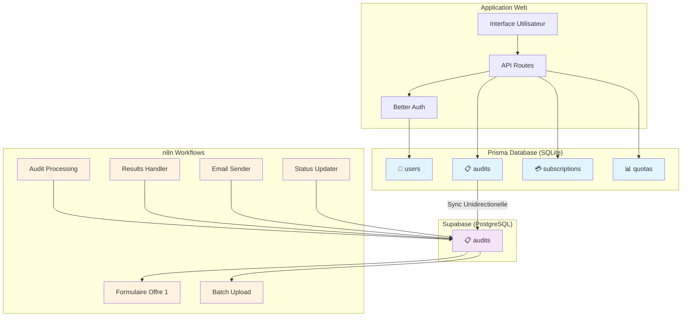

# Architecture Dual Database v2.0

**Analyseur Web Pro - Documentation Technique**

---

## 🎯 Vue d'ensemble

L'**Architecture Dual Database v2.0** est une approche optimisée qui utilise deux bases de données complémentaires :

- **Prisma (SQLite)** : Source de vérité pour les données applicatives
- **Supabase (PostgreSQL)** : Interface pour les workflows n8n

Cette architecture permet de conserver la flexibilité de Prisma tout en supportant les workflows n8n existants configurés pour Supabase.

---

## 📊 Comparaison v1.0 → v2.0

### ❌ Problèmes v1.0

- **629 lignes** de code complexe dans SupabaseBridge
- **3 tables** Supabase : profiles, subscribers, audits
- **Synchronisation bidirectionnelle** lourde et fragile
- **Logique fallback** partout dans le code
- **Redondance** massive des données
- **Maintenance** difficile

### ✅ Solutions v2.0

- **~200 lignes** de code simplifié (-68%)
- **1 table** Supabase : audits uniquement
- **Synchronisation unidirectionnelle** Prisma → Supabase
- **Architecture claire** et prévisible
- **Performance** optimisée
- **Maintenance** simplifiée

---

## 🏗️ Architecture Technique



---

## 🗃️ Répartition des données

### Prisma (Source de vérité)

```typescript
// Données utilisateur complètes
User {
  id: string
  email: string
  name: string
  monthlyQuota: number      // 🆕 Quotas intégrés
  quotaUsed: number         // 🆕 Usage actuel
  quotaResetDate: Date      // 🆕 Date de reset
  subscribed: boolean
  // ... autres champs
}

// Audits complets avec historique
Audit {
  id: string
  email: string
  url: string
  status: AuditStatus
  scoreGlobal?: number
  scorePerformance?: number
  scoreSeo?: number
  scoreSecurity?: number
  scoreModern?: number
  resultsJson?: Json
  auditResults?: Json
  // ... historique complet
}

// Abonnements Stripe
Subscription {
  id: string
  userId: string
  stripeSubscriptionId: string
  status: string
  // ... données Stripe
}
```

### Supabase (Interface n8n)

```sql
-- Table unique optimisée pour workflows n8n
CREATE TABLE audits (
  id UUID PRIMARY KEY,
  prisma_id TEXT,              -- 🔗 Lien vers Prisma
  user_id UUID,
  email TEXT NOT NULL,
  url TEXT NOT NULL,
  status TEXT,
  audit_type TEXT,

  -- Scores pour workflows n8n
  score_global INTEGER,
  score_performance INTEGER,
  score_seo INTEGER,
  score_security INTEGER,
  score_modern INTEGER,

  -- Résultats pour workflows n8n
  results_json JSONB,
  audit_results JSONB,
  error_message TEXT,

  -- Metadata workflows
  org_id TEXT,
  webhook_id TEXT,

  -- Timestamps
  created_at TIMESTAMPTZ DEFAULT now(),
  updated_at TIMESTAMPTZ DEFAULT now(),
  completed_at TIMESTAMPTZ
);
```

---

## 🔄 Système de Synchronisation

### AuditSyncService

Service central pour la synchronisation Prisma ↔ Supabase :

```typescript
// Sync Prisma → Supabase (pour workflows n8n)
const result = await AuditSyncService.syncAuditToSupabase({
  auditId: "audit-123",
  userId: "user-456",
  email: "user@example.com",
  url: "https://site.com",
  auditType: "manual",
  orgId: "org-789",
});

// Sync résultats Supabase → Prisma (optionnel)
const success = await AuditSyncService.syncResultsBackToPrisma("audit-123");

// Nettoyage orphelins
const cleanup = await AuditSyncService.cleanupOrphanedAudits();

// Statistiques
const stats = await AuditSyncService.getSyncStats();
```

### Flux de synchronisation

1. **Création audit** : Prisma (source de vérité)
2. **Webhook automatique** : Sync vers Supabase
3. **Processing n8n** : Workflows utilisent Supabase
4. **Résultats** : Mise à jour dans Supabase
5. **Sync back** : Résultats vers Prisma (optionnel)

---

## 🚀 Workflows n8n

### Configuration actuelle

Les 6 workflows existants utilisent exclusivement la table `audits` de Supabase :

```json
{
  "tableId": "audits",
  "operation": "insert|select|update",
  "schema": "public"
}
```

### Endpoints workflow

- `POST /webhook/formulaire-offre-1` - Audit single
- `POST /webhook/batch-upload` - Audit batch
- `POST /webhook/audit-completed` - Résultats
- `POST /webhook/status-update` - Statuts

### Compatibilité

✅ **100% compatible** avec les workflows existants
✅ **Aucune modification** des workflows n8n requise
✅ **Performance améliorée** avec les nouveaux index

---

## 🛠️ Implementation

### 1. Migration Supabase

Exécuter le script SQL fourni :

```sql
-- Fichier: supabase-migration-audits-v2.sql
-- Ajouter colonnes manquantes
-- Créer index optimisés
-- Supprimer tables obsolètes
```

### 2. Configuration environnement

```bash
# Supabase (pour workflows n8n)
SUPABASE_URL="https://xxx.supabase.co"
SUPABASE_SERVICE_KEY="eyJ..."

# Prisma (source de vérité)
DATABASE_URL="file:./prisma/dev.db"

# n8n Integration
N8N_BASE_URL="https://n8n.example.com"
N8N_WEBHOOK_SECRET="secret"
```

### 3. Tests et validation

```bash
# Test de synchronisation
npx tsx scripts/test-audit-sync-service.ts

# Nettoyage des orphelins
npx tsx scripts/cleanup-supabase-orphaned-data.ts

# Statistiques
npx tsx scripts/audit-sync-stats.ts
```

---

## 📈 Avantages

### Performance

- **68% moins de code** (629 → 200 lignes)
- **Requêtes optimisées** avec index spécialisés
- **Pas de synchronisation** profiles/subscribers
- **Moins d'overhead** réseau

### Maintenance

- **Architecture claire** et prévisible
- **Source de vérité unique** (Prisma)
- **Debugging simplifié**
- **Tests automatisés**

### Évolutivité

- **Ajout facile** de nouveaux workflows
- **Scalabilité** horizontale Supabase
- **Migration future** simplifiée
- **Monitoring** intégré

---

## 🔧 Maintenance

### Scripts de maintenance

```bash
# Statistiques quotidiennes
scripts/audit-sync-stats.ts

# Nettoyage hebdomadaire
scripts/cleanup-supabase-orphaned-data.ts

# Vérification santé
scripts/health-check-dual-db.ts

# Resync complet (si nécessaire)
scripts/full-resync-audits.ts
```

### Monitoring

Métriques à surveiller :

- **Taux de synchronisation** : >95%
- **Audits orphelins** : <10
- **Latence sync** : <2s
- **Erreurs/jour** : <5

### Alertes recommandées

- ❌ **Échec sync** : >10 audits non synchronisés
- ⚠️ **Orphelins** : >50 audits orphelins
- 🐌 **Latence** : Sync >5s
- 💾 **Espace** : Base Supabase >80%

---

## 🚨 Dépannage

### Problèmes courants

#### 1. Échec de synchronisation

```bash
# Vérifier la connexion Supabase
npx tsx scripts/test-supabase-connection.ts

# Relancer la synchronisation
AuditSyncService.syncAuditToSupabase(payload)
```

#### 2. Audits orphelins

```bash
# Nettoyer automatiquement
npx tsx scripts/cleanup-supabase-orphaned-data.ts
```

#### 3. Workflows n8n en échec

```bash
# Vérifier la table audits Supabase
SELECT COUNT(*) FROM audits WHERE status = 'pending';

# Vérifier les colonnes requises
\d audits
```

### Logs de débogage

```typescript
// Activer les logs détaillés
console.log("🔄 [AuditSync] Début synchronisation", { auditId });
console.log("✅ [AuditSync] Sync réussie", { supabaseId });
```

---

## 🔮 Évolutions futures

### Phase 3 (Optionnelle)

- **Migration complète** vers PostgreSQL
- **Suppression SQLite**
- **Unification** des bases

### Améliorations possibles

- **Sync temps réel** avec WebSockets
- **Cache Redis** pour performances
- **Analytics** avancés
- **Backup automatique**

---

## 👥 Équipe

**Développeurs** : Architecture et implémentation
**DevOps** : Monitoring et maintenance
**Product** : Évolution fonctionnelle

---

## 📚 Ressources

- [Prisma Documentation](https://www.prisma.io/docs)
- [Supabase Documentation](https://supabase.com/docs)
- [n8n Documentation](https://docs.n8n.io)
- [Better Auth Documentation](https://www.better-auth.com/docs)

---

_Architecture Dual Database v2.0 - Analyseur Web Pro_
_Dernière mise à jour : 2025-01_
